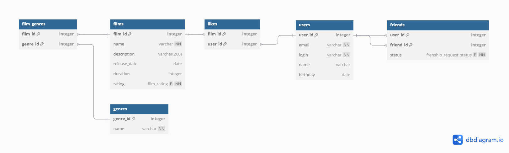

# java-filmorate

### ER-Диаграмма


SQL-схема: [Filmorate(PsgSQL).sql](src%2Fmain%2Fresources%2FFilmorate%28PsgSQL%29.sql)

### Описание таблиц:

#### Таблица films:

| Поле         | Тип                                                  | Описание                                                      |
|--------------|------------------------------------------------------|---------------------------------------------------------------|
| film_id      | INTEGER GENERATED BY DEFAULT AS IDENTITY PRIMARY KEY | Автоматически генерируемый ID                                 |
| name         | varchar NOT NULL                                     | Название фильма не может быть пустым                          |
| description  | varchar(200)                                         | Описание длиной до 200 символов                               |
| release_date | date                                                 | Дата выхода должна быть не раньше 28.12.1895                  |
| duration     | integer                                              | Продолжительность должна быть положительным числом            |
| rating       | enum film_rating NOT NULL                            | Enum с возрастными рейтингами фильмов, должен быть проставлен |

#### Таблица users:

| Поле     | Тип                                                  | Описание                                           |
|----------|------------------------------------------------------|----------------------------------------------------|
| user_id  | INTEGER GENERATED BY DEFAULT AS IDENTITY PRIMARY KEY | Автоматически генерируемый ID                      |
| email    | varchar UNIQUE NOT NULL                              | Email Не может быть пустым, должен быть уникальным |
| login    | varchar UNIQUE NOT NULL                              | Логин Не может быть пустым, должен быть уникальным |
| name     | varchar                                              | Имя пользователя, может быть пустым                |
| birthday | date                                                 | Дата рождения не может быть в будущем              |

#### Таблица genres:

| Поле     | Тип                                                  | Описание                                 |
|----------|------------------------------------------------------|------------------------------------------|
| genre_id | INTEGER GENERATED BY DEFAULT AS IDENTITY PRIMARY KEY | Автоматически генерируемый ID            |
| name     | varchar UNIQUE NOT NULL                              | Наименование жанра, не может быть пустым |

#### Таблица friends:

| Поле      | Тип                                   | Описание                                |
|-----------|---------------------------------------|-----------------------------------------|
| user_id   | INTEGER PRIMARY KEY (FOREIGN KEY)     | Ссылка на таблицу users                 |
| friend_id | INTEGER PRIMARY KEY (FOREIGN KEY)     | Ссылка на таблицу users                 |
| status    | enum frenship_request_status NOT NULL | Enum со статусами, не может быть пустым |

#### Таблица likes:

| Поле    | Тип                               | Описание                |
|---------|-----------------------------------|-------------------------|
| film_id | INTEGER PRIMARY KEY (FOREIGN KEY) | Ссылка на таблицу films |
| user_id | INTEGER PRIMARY KEY (FOREIGN KEY) | Ссылка на таблицу users |

#### Таблица film_genres:

| Поле     | Тип                               | Описание                 |
|----------|-----------------------------------|--------------------------|
| film_id  | INTEGER PRIMARY KEY (FOREIGN KEY) | Ссылка на таблицу films  |
| genre_id | INTEGER PRIMARY KEY (FOREIGN KEY) | Ссылка на таблицу genres |

### Примеры основных запросов:

- выборка всех пользователей
```sql
SELECT *
FROM users;
```

- выборка всех фильмов
```sql
SELECT *
FROM films;
```

- выборка пользователя по id
```sql
SELECT *
FROM users
WHERE user_id = 7;
```

- выборка фильма по id
```sql
SELECT *
FROM films
WHERE film_id = 7;
```

- выборка друзей пользователя
```sql
SELECT u.name as user_name,
       f.name as friend_name,
       fs.status
FROM friends fs
         JOIN users u USING (user_id)
         JOIN users f ON fs.friend_id = f.user_id
WHERE u.user_id = 7
ORDER BY friend_name;
```

- выборка 10 самых популярных фильмов
```sql
SELECT ROW_NUMBER() OVER (ORDER BY likes DESC NULLS LAST) AS Row,
       f.name,
       l.likes
FROM films AS f
         JOIN (SELECT film_id,
                      COUNT(user_id) as likes
               FROM likes
               GROUP BY film_id) AS l USING (film_id)
LIMIT 10;
```

### Примеры дополнительных запросов для проверки работоспособности БД:

- количество фильмов, среднее количество лайков по жанрам и по рейтингу
```sql
SELECT g.name,
       f.rating,
       COUNT(fg.film_id)      AS film_count,
       ROUND(AVG(l.likes), 2) as avg_likes
FROM film_genres AS fg
         LEFT JOIN (SELECT film_id,
                           COUNT(*) as likes
                    FROM likes
                    GROUP BY film_id) AS l USING (film_id)
         LEFT JOIN films AS f USING (film_id)
         LEFT JOIN genres AS g USING (genre_id)
GROUP BY g.genre_id, f.rating;
```

- название фильма и количество лайков
```sql
SELECT f.name,
       l.likes
FROM films AS f
         LEFT JOIN(SELECT film_id,
                          COUNT(*) AS likes
                   FROM likes
                   GROUP BY film_id) AS l USING (film_id)
ORDER BY 2 DESC NULLS LAST;
```

- Количество фильмов по жанрам
```sql
SELECT g.name,
       COUNT(film_id) AS films_count
FROM genres AS g
         LEFT JOIN film_genres AS fg USING (genre_id)
GROUP BY genre_id
ORDER BY films_count DESC NULLS LAST;
```

- Фильмы и пользователи которые поставили лайки
```sql
SELECT f.name AS film_name,
       u.name AS user_name
FROM likes AS l
         JOIN users AS u USING (user_id)
         JOIN films AS f USING (film_id)
ORDER BY 1, 2;
```