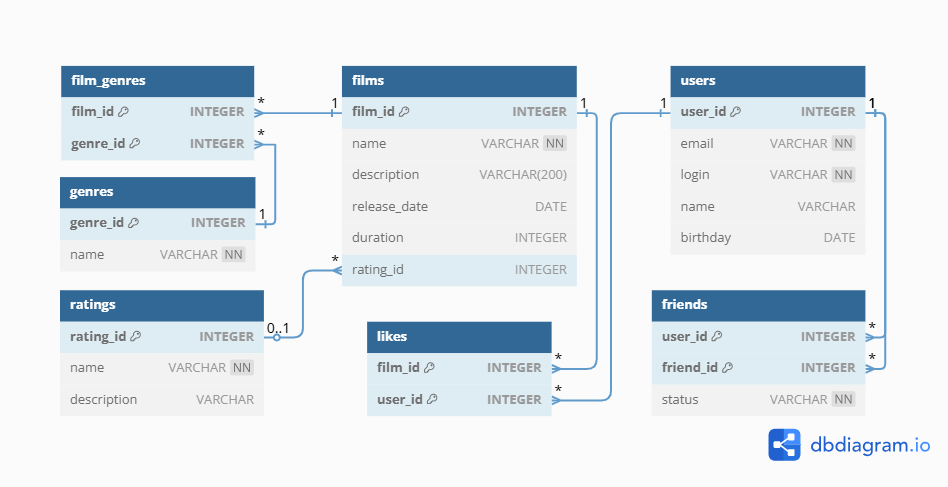

# Filmorate

Filmorate — это сервис для работы с фильмами и оценками пользователей.
Проект представляет собой бэкенд-приложение на Java (Spring Boot) с использованием базы данных H2, которое позволяет
добавлять фильмы,
пользователей, ставить лайки, добавлять в друзья и получать рейтинги фильмов.
Это учебный проект, реализующий функциональность социальной сети для киноманов.

## Архитектура проекта

Проект построен по классической трёхуровневой архитектуре:

1. **Контроллеры (Presentation Layer)** — обрабатывают HTTP-запросы, валидируют входные данные и возвращают ответы
   клиенту.
2. **Сервисы (Service Layer)** — содержат бизнес-логику приложения: управление друзьями, лайками, вычисление рейтингов.
3. **Хранилища (Data Access Layer)** — обеспечивают взаимодействие с базой данных через JDBC.

### Ключевые архитектурные решения

- **Интерфейсы хранилищ** (`FilmStorage`, `UserStorage`, `GenreStorage`, `MpaStorage`) позволяют легко заменить способ
  хранения данных (например, перейти с in-memory на БД).
- **Использование аннотаций Lombok** для сокращения шаблонного кода (геттеры, сеттеры, конструкторы, логирование).
- **Кастомные аннотации валидации** для специфических правил (например, проверка даты релиза).
- **Работа с БД через JdbcTemplate** — прямой контроль над SQL-запросами без лишней абстракции.

## Структура проекта

```text
 filmorate/
├── config/              # Конфигурационные классы Spring
├── controller/          # REST-контроллеры
├── exception/           # Кастомные исключения
├── exception_handler/   # Обработчики исключений (@RestControllerAdvice)
├── model/               # Модели данных
├── service/             # Бизнес-логика
├── storage/             # Интерфейсы хранилищ
├── util/                # Утилитарные классы и хелперы
└── validator/           # Кастомные аннотации валидации
```

### ER-Диаграмма


SQL-схема: [schema.sql](src%2Fmain%2Fresources%2Fschema.sql)

### Описание таблиц:

#### Таблица mpa:

| Поле        | Тип                                                  | Описание                                            |
|-------------|------------------------------------------------------|-----------------------------------------------------|
| mpa_id      | INTEGER GENERATED BY DEFAULT AS IDENTITY PRIMARY KEY | Автоматически генерируемый ID                       |
| name        | VARCHAR UNIQUE NOT NULL                              | Название рейтинга уникальное и не может быть пустым |
| description | VARCHAR                                              | Описание                                            |

#### Таблица films:

| Поле         | Тип                                                      | Описание                                           |
|--------------|----------------------------------------------------------|----------------------------------------------------|
| film_id      | INTEGER GENERATED BY DEFAULT AS IDENTITY PRIMARY KEY     | Автоматически генерируемый ID                      |
| name         | VARCHAR NOT NULL                                         | Название фильма не может быть пустым               |
| description  | VARCHAR(200)                                             | Описание длиной до 200 символов                    |
| release_date | DATE                                                     | Дата должна быть не раньше 28.12.1895              |
| duration     | INTEGER                                                  | Продолжительность должна быть положительным числом |
| mpa-id       | INTEGER REFERENCES ratings(rating_id) ON DELETE SET NULL | Ссылка на таблицу mpa                              |

#### Таблица users:

| Поле     | Тип                                                  | Описание                                           |
|----------|------------------------------------------------------|----------------------------------------------------|
| user_id  | INTEGER GENERATED BY DEFAULT AS IDENTITY PRIMARY KEY | Автоматически генерируемый ID                      |
| email    | VARCHAR UNIQUE NOT NULL                              | Email Не может быть пустым, должен быть уникальным |
| login    | VARCHAR UNIQUE NOT NULL                              | Логин Не может быть пустым, должен быть уникальным |
| name     | VARCHAR                                              | Имя пользователя, может быть пустым                |
| birthday | DATE                                                 | Дата рождения не может быть в будущем              |

#### Таблица genres:

| Поле     | Тип                                                  | Описание                                 |
|----------|------------------------------------------------------|------------------------------------------|
| genre_id | INTEGER GENERATED BY DEFAULT AS IDENTITY PRIMARY KEY | Автоматически генерируемый ID            |
| name     | VARCHAR UNIQUE NOT NULL                              | Наименование жанра, не может быть пустым |

#### Таблица friends:

| Поле      | Тип                                                             | Описание                                 |
|-----------|-----------------------------------------------------------------|------------------------------------------|
| user_id   | INTEGER REFERENCES users(user_id) ON DELETE CASCADE PRIMARY KEY | Ссылка на таблицу users, PK              |
| friend_id | INTEGER REFERENCES users(user_id) ON DELETE CASCADE PRIMARY KEY | Ссылка на таблицу users, PK              |
| status    | VARCHAR NOT NULL DEFAULT ('UNCONFIRMED')                        | Статус дружбы 'UNCONFIRMED', 'CONFIRMED' |

#### Таблица likes:

| Поле    | Тип                                                             | Описание                    |
|---------|-----------------------------------------------------------------|-----------------------------|
| film_id | INTEGER REFERENCES films(film_id) ON DELETE CASCADE PRIMARY KEY | Ссылка на таблицу films, PK |
| user_id | INTEGER REFERENCES users(user_id) ON DELETE CASCADE PRIMARY KEY | Ссылка на таблицу users, PK |

#### Таблица film_genres:

| Поле     | Тип                                                               | Описание                     |
|----------|-------------------------------------------------------------------|------------------------------|
| film_id  | INTEGER REFERENCES films(film_id) ON DELETE CASCADE PRIMARY KEY   | Ссылка на таблицу films, PK  |
| genre_id | INTEGER REFERENCES genres(genre_id) ON DELETE CASCADE PRIMARY KEY | Ссылка на таблицу genres, PK |

### Примеры основных запросов:

- выборка всех пользователей

```sql
SELECT *
FROM users;
```

- выборка всех фильмов

```sql
SELECT *
FROM films;
```

- выборка пользователя по id

```sql
SELECT *
FROM users
WHERE user_id = 7;
```

- выборка фильма по id

```sql
SELECT *
FROM films
WHERE film_id = 7;
```

- выборка друзей пользователя

```sql
SELECT u.name as user_name,
       f.name as friend_name,
       fs.status
FROM friends fs
         JOIN users u USING (user_id)
         JOIN users f ON fs.friend_id = f.user_id
WHERE u.user_id = 7
ORDER BY friend_name;
```

- выборка 10 самых популярных фильмов

```sql
SELECT ROW_NUMBER() OVER (ORDER BY likes DESC NULLS LAST) AS Row,
       f.name,
       l.likes
FROM films AS f
         JOIN (SELECT film_id,
                      COUNT(user_id) as likes
               FROM likes
               GROUP BY film_id) AS l USING (film_id)
LIMIT 10;
```

### API Эндпоинты

#### Фильмы (/films)

| Метод  | Эндпоинт                  | Описание                            | Параметры                                                           |
|--------|---------------------------|-------------------------------------|---------------------------------------------------------------------|
| GET    | /films                    | Получение списка всех фильмов       | —                                                                   |
| GET    | /films/{id}               | Получение фильма по идентификатору  | `id` (path) — ID фильма                                             |
| POST   | /films                    | Создание нового фильма              | Тело запроса с полями фильма                                        |
| PUT    | /films                    | Обновление существующего фильма     | Тело запроса с полями фильма                                        |
| PUT    | /films/{id}/like/{userId} | Добавление лайка фильму             | `id` (path) — ID фильма, `userId` (path) — ID пользователя          |
| DELETE | /films/{id}/like/{userId} | Удаление лайка у фильма             | `id` (path) — ID фильма, `userId` (path) — ID пользователя          |
| GET    | /films/popular            | Получение списка популярных фильмов | `count` (query, опционально) — количество фильмов (по умолчанию 10) |

#### Пользователи (/users)

| Метод  | Эндпоинт                             | Описание                                 | Параметры                                                                 |
|--------|--------------------------------------|------------------------------------------|---------------------------------------------------------------------------|
| GET    | /users                               | Получение списка всех пользователей      | —                                                                         |
| GET    | /users/{id}                          | Получение пользователя по идентификатору | `id` (path) — ID пользователя                                             |
| POST   | /users                               | Создание нового пользователя             | Тело запроса с полями пользователя                                        |
| PUT    | /users                               | Обновление существующего пользователя    | Тело запроса с полями пользователя                                        |
| PUT    | /users/{id}/friends/{friendId}       | Добавление пользователя в друзья         | `id` (path) — ID пользователя, `friendId` (path) — ID друга               |
| DELETE | /users/{id}/friends/{friendId}       | Удаление пользователя из друзей          | `id` (path) — ID пользователя, `friendId` (path) — ID друга               |
| GET    | /users/{id}/friends                  | Получение списка друзей пользователя     | `id` (path) — ID пользователя                                             |
| GET    | /users/{id}/friends/common/{otherId} | Получение списка общих друзей            | `id` (path) — ID пользователя, `otherId` (path) — ID другого пользователя |

#### Жанры (/genres)

| Метод | Эндпоинт     | Описание                          | Параметры              |
|-------|--------------|-----------------------------------|------------------------|
| GET   | /genres      | Получение списка всех жанров      | —                      |
| GET   | /genres/{id} | Получение жанра по идентификатору | `id` (path) — ID жанра |

#### Рейтинги MPA (/mpa)

| Метод | Эндпоинт  | Описание                             | Параметры                 |
|-------|-----------|--------------------------------------|---------------------------|
| GET   | /mpa      | Получение списка всех рейтингов MPA  | —                         |
| GET   | /mpa/{id} | Получение рейтинга по идентификатору | `id` (path) — ID рейтинга |

## Предварительные требования
- JDK 17 или новее
- Maven 3.6+

## Виды тестов в проекте
- Модульные тесты — тестирование отдельных компонентов
- Интеграционные тесты — проверка взаимодействия с БД