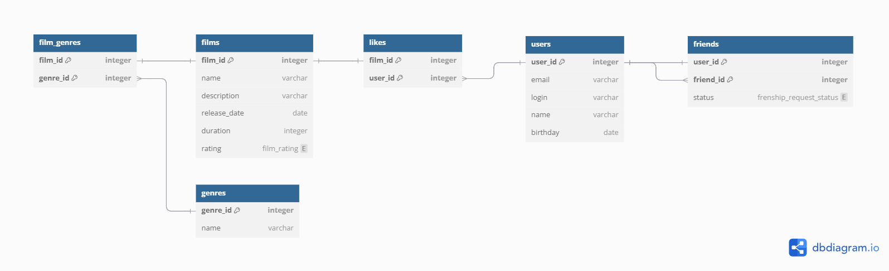

# java-filmorate
## ER-Diagram:

Файл со схемой БД:
[Filmorate_1(PsgSQL).sql](Filmorate_1%28PsgSQL%29.sql)

### Пояснения:
Ключевые поля для таблиц: **films**, **users**, **genres** - это их _id_.

Ключевые поля для связывающих таблиц:
- **film_genres** - это _film_id_, _genre_id_
- **likes** - _film_id_, _user_id_
- **friends** - _user_id_, _frind_id_

### Примеры запросов SQL к БД:
#### Основные запросы:
```sql
--выборка всех пользователей
SELECT * 
FROM users;

--выборка всех фильмов
SELECT *
FROM films;

--выборка пользователя по id
SELECT *
FROM users
WHERE user_id = 7;

--выборка фильма по id
SELECT *
FROM films
WHERE film_id = 7;

--выборка друзей пользователей
SELECT u.name as user_name,
       f.name as friend_name
FROM friends fs
JOIN users u USING(user_id)
JOIN users f ON fs.friend_id = f.user_id
ORDER BY fs.user_id;

--выборка 10 самых популярных фильмов
SELECT ROW_NUMBER() OVER(ORDER BY likes DESC NULLS LAST) AS Row,
       f.name,
       l.likes
FROM films AS f
JOIN (
      SELECT 
            film_id, 
            COUNT(user_id) as likes
      FROM likes
      GROUP BY film_id
      ) AS l USING(film_id)
LIMIT 10;

```
#### Дополнительные запросы для проверки корректности связей в схеме:
```sql
--колличество фильмов, среднее количество лайков по жанрам и по рейтингу 
SELECT g.name,
       f.rating,
       COUNT(fg.film_id) AS film_count,
       ROUND(AVG(l.likes),2) as avg_likes
FROM film_genres AS fg
LEFT JOIN (
      SELECT film_id, 
            COUNT(*) as likes
      FROM likes
      GROUP BY film_id
      ) AS l USING (film_id)
LEFT JOIN films AS f USING(film_id)
LEFT JOIN genres AS g USING(genre_id)
GROUP BY g.genre_id, f.rating;

--название фильма и количество лайков
SELECT f.name,
       l.likes
FROM films AS f
LEFT JOIN(
      SELECT film_id, 
            COUNT(*) AS likes
      FROM likes
      GROUP BY film_id
      ) AS l USING(film_id)
ORDER BY 2 DESC NULLS LAST;

--Количество фильмов по жанрам
SELECT g.name,
       COUNT(film_id) AS films_count
FROM genres AS g
LEFT JOIN film_genres AS fg USING(genre_id)
GROUP BY genre_id
ORDER BY films_count DESC NULLS LAST;

--Фильмы и пользователи которые поставили лайки
SELECT f.name AS film_name,
       u.name AS user_name
FROM likes AS l
JOIN users AS u USING(user_id)
JOIN films AS f USING(film_id)
ORDER BY 1, 2;

```